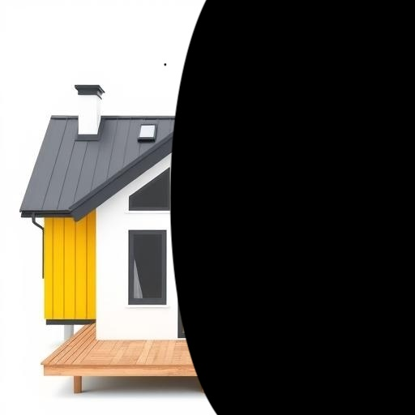
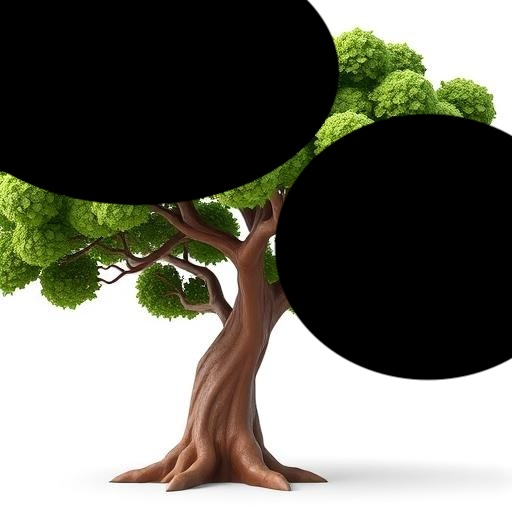
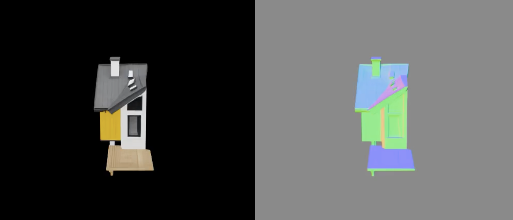
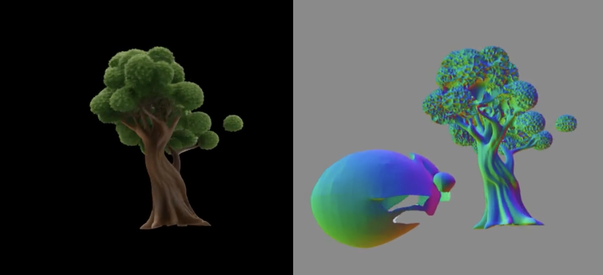
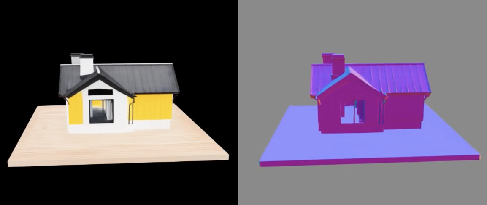
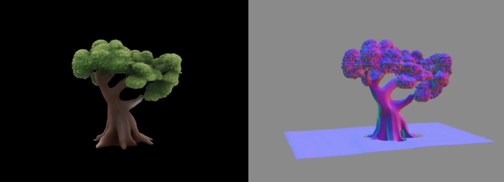

# Occluded TRELLIS ✨
<p align="center">
<a href='https://huggingface.co/spaces/cortwave/OccludedTRELLIS'></a>
</p>

Run [TRELLIS](https://github.com/microsoft/TRELLIS) Image2Mesh generation pipeline on partially occluded images.

## 🔍 Use cases:
* You have only a partially visible image of the object.
* You want to ignore some areas of the image.

## 🎨 Examples
### 🖼️ Input images



### 🥷 TRELLIS results



### 🌟 Occluded TRELLIS results



## 🔧 How to use

### 👨🏻‍💻 In code
1. Install this library using pip:
    ```bash
    pip install occluded-trellis
    ```
    **Important:**

    This library doesn't bring any dependencies and fully relies on the already configured [TRELLIS](https://github.com/microsoft/TRELLIS)
    environment.

2. Wrap `TrellisImageTo3DPipeline`:
   ```python
   # assumes that you already created an instance of TrellisImageTo3DPipeline as pipe
   from occluded_trellis import apply_occluded_patch
   pipe = apply_occluded_patch(pipe)
   ```

3. Call the patched pipeline. It has the same run method, but now you need to pass a `mask` PIL image, where white pixels (255, 255, 255) -
non-occluded pixels, and black pixels (0, 0, 0) - occluded:
   ```python
   outputs = pipe.run(image, mask) 
   ```
   **Important:**

    - Multiple image prediction is not implemented for the occluded version.
    
    - If your `image` is corrupted (has big black blobs or other artifacts), even without a mask, it's better to
      provide it as an "RGBA" PIL Image with already existing alpha channels to avoid `rembg` artifacts during preprocessing (it works
      very poorly with corrupted/occluded images).
### 🔸 Using Gradio demo
1. Place `demo/app.py` to the root of your TRELLIS project and launch it:
    ```bash
    python3 app.py
    ```

## 🧐 What happens inside

The most interesting part is here:

The original TRELLIS model uses DinoV2 tokens of the image as a condition for the mesh generation. DinoV2 is a visual transformer,
and as one of its pretraining tasks, it was trained on masked tokens. That means we can drop these tokens even before the transformer
part of DinoV2 and still obtain good semantic tokens representing the image.

Since TRELLIS uses Dino tokens in cross-attention modules, we can also drop some of them (or just
pass fewer tokens). That's it :)

## ⚖️ License and acknowledgments

This repository uses and modifies code from:
* [TRELLIS](https://github.com/microsoft/TRELLIS) (gradio demo and parts of the Image-to-Mesh pipeline)
    ```
    @article{xiang2024structured,
        title   = {Structured 3D Latents for Scalable and Versatile 3D Generation},
        author  = {Xiang, Jianfeng and Lv, Zelong and Xu, Sicheng and Deng, Yu and Wang, Ruicheng and Zhang, Bowen and Chen, Dong and Tong, Xin and Yang, Jiaolong},
        journal = {arXiv preprint arXiv:2412.01506},
        year    = {2024}
    }
    ```
* [dinov2](https://github.com/facebookresearch/dinov2) (function for masking input image patches)
    ```
    @misc{oquab2023dinov2,
      title={DINOv2: Learning Robust Visual Features without Supervision},
      author={Oquab, Maxime and Darcet, Timothée and Moutakanni, Theo and Vo, Huy V. and Szafraniec, Marc and Khalidov, Vasil and Fernandez, Pierre and Haziza, Daniel and Massa, Francisco and El-Nouby, Alaaeldin and Howes, Russell and Huang, Po-Yao and Xu, Hu and Sharma, Vasu and Li, Shang-Wen and Galuba, Wojciech and Rabbat, Mike and Assran, Mido and Ballas, Nicolas and Synnaeve, Gabriel and Misra, Ishan and Jegou, Herve and Mairal, Julien and Labatut, Patrick and Joulin, Armand and Bojanowski, Piotr},
      journal={arXiv:2304.07193},
      year={2023}
    }
    ```
    ```
    @misc{darcet2023vitneedreg,
      title={Vision Transformers Need Registers},
      author={Darcet, Timothée and Oquab, Maxime and Mairal, Julien and Bojanowski, Piotr},
      journal={arXiv:2309.16588},
      year={2023}
    }
    ```
Corresponding licenses were included in the *LICENSE* file. The rest of the code has an MIT License.
